# Projeto Banco — API

Atividade Avaliativa — Engenharia de Software (3ESPW) — FIAP 2026
Professor Rafael S. Novo Pereira

## 1. Identificação

| Nome | RM |
|---|---|
| Luiz Gustavo da Silva | 558358 |
| Guilherme Oliveira Santana de Almeida | 555180 |

Formação: **Dupla**.

## 2. Produto bancário escolhido

**Empréstimo (`Emprestimo`)**.

Justificativa: é o produto que permite expressar a regra de negócio extra exigida da dupla (cálculo de score, ajuste de taxa de juros conforme score do cliente e ajuste do valor aprovado). Os outros produtos (`MaquinaDeCartao` e `ReceberSalario`) também aparecem no diagrama e no domínio, mas só `Emprestimo` tem regra de análise efetiva implementada — o que está consistente com o item "Preciso implementar os 3 produtos? Não. Implemente 1 (individual/dupla)" do enunciado.

### Regra de negócio extra (dupla)
Implementada em [src/BancoDigital.API/Services/AnaliseCreditoService.cs](src/BancoDigital.API/Services/AnaliseCreditoService.cs):

- **Score base = 500**, ajustado por:
  - **PF**: idade (faixa 25-60 → +100), renda mensal (≥10k → +250; ≥5k → +150; ≥2k → +80; <1.5k → −100), razão valor solicitado/renda (penalidade quando excessiva).
  - **PJ**: tempo de existência (≥5 anos → +200; ≥2 anos → +100; <2 → −50), faturamento mensal (≥100k → +200), razão valor/faturamento.
- **Aprovação**: score < 300 → reprovado; valor fora dos limites do produto → reprovado.
- **Taxa de juros aplicada**: parte da `TaxaJurosBaseAoMes` do produto e aplica desconto/acréscimo:
  - score ≥ 800 → −40% sobre a taxa base
  - score ≥ 650 → −20%
  - score ≥ 500 → 0%
  - score ≥ 400 → +30%
  - <400 → +60%
- **Valor aprovado**: pode ser reduzido se o score for médio/baixo (até 60% do valor solicitado), respeitando os limites do produto.

## 3. Decisão de modelagem da fila

**Decisão: 1 fila única, in-memory (`System.Threading.Channels`).**

A entrega original do enunciado sugere RabbitMQ, mas o ambiente de avaliação não dispõe de Docker/RabbitMQ instalado, então o processamento assíncrono foi modelado com uma **fila in-process** consumida por um `BackgroundService` (`HostedService`), preservando a semântica de mensageria:

- O endpoint `POST /api/contratacoes` apenas persiste a `Contratacao` com `Status = Pendente` e **publica** uma mensagem (`ContratacaoMensagem`) na fila — retornando **202 Accepted** imediatamente. Não bloqueia o request com a análise.
- O **consumer** (`ContratacaoWorker`) lê a fila em background, simula latência de análise (delay de 500 ms), executa a regra de negócio (`AnaliseCreditoService`) e atualiza o `Status` para `Aprovada` / `Reprovada` / `Falha`.
- O cliente consulta o resultado via `GET /api/contratacoes/{id}` — quando `Status` for terminal e `DataProcessamento` estiver preenchida, o processamento concluiu.

Por que **uma única fila** e não múltiplas:
1. Volume e tipo de carga homogêneos — todas as contratações seguem o mesmo fluxo (recebe → analisa → atualiza).
2. Roteamento por tipo de produto é resolvido em tempo de processamento (`switch` por subclasse de `Produto`), sem ganho real em separar filas.
3. Simplicidade operacional: 1 worker + 1 fila é mais fácil de raciocinar e testar.

Trade-off assumido: a fila não sobrevive a restart do processo (é in-memory). Se o processo morrer com mensagens não consumidas, a `Contratacao` fica perpetuamente `Pendente`. Em produção isso seria substituído por RabbitMQ (mesma interface `IContratacaoQueue`, basta uma implementação alternativa).

Componentes:
- [`IContratacaoQueue`](src/BancoDigital.API/Workers/ContratacaoQueue.cs) — abstração da fila (publish/consume).
- [`ContratacaoQueue`](src/BancoDigital.API/Workers/ContratacaoQueue.cs) — implementação `Channel<T>` unbounded, single-reader.
- [`ContratacaoWorker`](src/BancoDigital.API/Workers/ContratacaoWorker.cs) — `BackgroundService` que consome continuamente.

## 4. Diagrama de classes

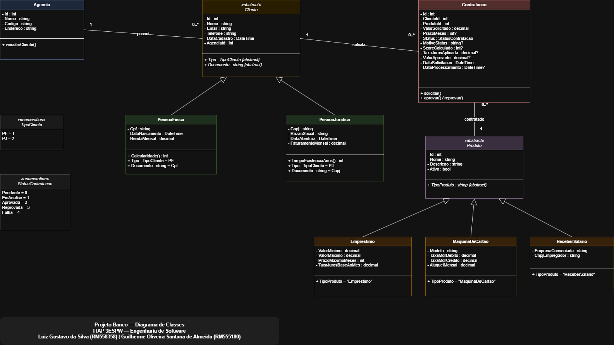

Arquivo fonte editável: [diagrama/diagrama-classes.drawio](diagrama/diagrama-classes.drawio) — abrir no [draw.io](https://app.diagrams.net/).

Cobre:
- Hierarquia `Cliente` (abstract) → `PessoaFisica` / `PessoaJuridica`.
- Hierarquia `Produto` (abstract) → `Emprestimo` / `MaquinaDeCartao` / `ReceberSalario`.
- `Agencia` 1 ↔ 0..* `Cliente`.
- `Cliente` 1 ↔ 0..* `Contratacao` ↔ 1 `Produto`.
- Enums `TipoCliente` e `StatusContratacao`.

## 5. Como rodar localmente

### Pré-requisitos
- .NET 8 SDK (ou .NET 9 SDK — o projeto está com `<TargetFramework>net8.0</TargetFramework>` e ambos compilam).
- Acesso à instância Oracle FIAP (`oracle.fiap.com.br:1521/ORCL`).
- (Opcional) Cliente Oracle / SQL Developer para inspecionar o banco.

### 1. Configurar a connection string
Editar [src/BancoDigital.API/appsettings.json](src/BancoDigital.API/appsettings.json) e substituir `COLOQUE_SUA_SENHA` pela senha individual do RM:

```json
"ConnectionStrings": {
  "Oracle": "Data Source=oracle.fiap.com.br:1521/ORCL;User Id=RM558358;Password=SUA_SENHA_AQUI;"
}
```

### 2. Aplicar migrations
Da raiz do repositório:

```bash
dotnet ef database update --project src/BancoDigital.API
```

Cria as tabelas `AGENCIAS`, `CLIENTES` (com discriminador `TIPO_CLIENTE` para PF/PJ), `PRODUTOS` (discriminador `TIPO_PRODUTO`) e `CONTRATACOES`. O seed de produtos e de uma agência inicial roda automaticamente no startup da API.

### 3. Rodar a API

```bash
dotnet run --project src/BancoDigital.API
```

Swagger abre na raiz: `https://localhost:7xxx/` (porta exibida no console).

## 6. Endpoints disponíveis

### POST /api/agencias — cadastrar agência
**Request**:
```json
{
  "nome": "Agência Centro",
  "codigo": "0001",
  "endereco": "Av. Paulista, 1000"
}
```
**Response 201**:
```json
{ "id": 1, "nome": "Agência Centro", "codigo": "0001", "endereco": "Av. Paulista, 1000" }
```

### GET /api/agencias/{id} — buscar agência
**Response 200**:
```json
{ "id": 1, "nome": "Agência Centro", "codigo": "0001", "endereco": "Av. Paulista, 1000" }
```
**Response 404** quando o id não existir.

### POST /api/clientes/pf — cadastrar pessoa física
**Request**:
```json
{
  "nome": "Luiz Gustavo",
  "email": "luiz@teste.com",
  "telefone": "11999990000",
  "cpf": "529.982.247-25",
  "dataNascimento": "1995-05-10",
  "rendaMensal": 8000,
  "agenciaId": 1
}
```
**Response 201**:
```json
{
  "id": 1, "tipo": "PF", "nome": "Luiz Gustavo", "documento": "52998224725",
  "agenciaId": 1, "agenciaNome": "Agência Centro",
  "dataNascimento": "1995-05-10T00:00:00Z", "rendaMensal": 8000.00
}
```
**Response 400** CPF inválido. **409** CPF duplicado. **404** agência inexistente.

### POST /api/clientes/pj — cadastrar pessoa jurídica
**Request**:
```json
{
  "nome": "Empresa X",
  "email": "empresa@teste.com",
  "cnpj": "11.444.777/0001-61",
  "razaoSocial": "Empresa X LTDA",
  "dataAbertura": "2015-06-01",
  "faturamentoMensal": 250000,
  "agenciaId": 1
}
```
**Response 201** análoga ao PF, com `tipo: "PJ"` e `razaoSocial`/`faturamentoMensal` preenchidos.

### GET /api/clientes/{id} — buscar cliente
Retorna o cliente (PF ou PJ) já com o nome da agência. **404** quando não existir.

### POST /api/contratacoes — solicitar contratação (publica na fila)
**Request**:
```json
{
  "clienteId": 1,
  "produtoId": 1,
  "valorSolicitado": 5000,
  "prazoMeses": 24
}
```
**Response 202 Accepted**:
```json
{
  "id": 1, "clienteId": 1, "produtoId": 1,
  "valorSolicitado": 5000, "prazoMeses": 24,
  "status": "Pendente",
  "dataSolicitacao": "2026-05-05T12:00:00Z"
}
```
- **404** cliente ou produto não existir.
- **400** prazo acima do máximo permitido pelo produto, produto inativo, etc.

### GET /api/contratacoes/{id} — consultar status
**Response 200** após processamento:
```json
{
  "id": 1, "status": "Aprovada",
  "scoreCalculado": 830, "taxaJurosAplicada": 0.0150,
  "valorAprovado": 5000.00,
  "motivoStatus": "Aprovado com score 830. Taxa aplicada: 1,50% a.m.",
  "dataProcessamento": "2026-05-05T12:00:01Z"
}
```

### GET /api/produtos — listar produtos disponíveis
Retorna todos os produtos cadastrados (Empréstimo, MaquinaDeCartao, ReceberSalario) com seus parâmetros específicos.

## 7. Como executar os testes

```bash
dotnet test
```

Resultado esperado (rodado localmente em 2026-05-05):

```
Passed!  - Failed: 0, Passed: 29, Skipped: 0, Total: 29, Duration: 1 s
```

Cobertura dos fluxos críticos exigidos pelo enunciado:

| Fluxo crítico | Teste |
|---|---|
| Cadastro PF + CPF duplicado | `ClientesControllerTests.POST_pf_*` |
| Cadastro PJ + CNPJ duplicado | `ClientesControllerTests.POST_pj_*` |
| Cliente vinculado a agência inexistente | `ClientesControllerTests.POST_pf_com_agencia_inexistente_deve_retornar_404` |
| Solicitação de contratação válida (publica na fila, 202) | `ContratacoesControllerTests.POST_contratacao_valida_deve_retornar_202_e_publicar_na_fila` |
| Contratação para cliente inexistente (404) | `ContratacoesControllerTests.POST_contratacao_para_cliente_inexistente_deve_retornar_404` |
| Consulta de status após processamento | `ContratacoesControllerTests.GET_status_apos_processamento_deve_retornar_status_final` |
| Validação de CPF/CNPJ | `DocumentoValidatorTests` |
| Regra de negócio extra (cálculo de score) | `AnaliseCreditoServiceTests` |

### Print da execução dos testes

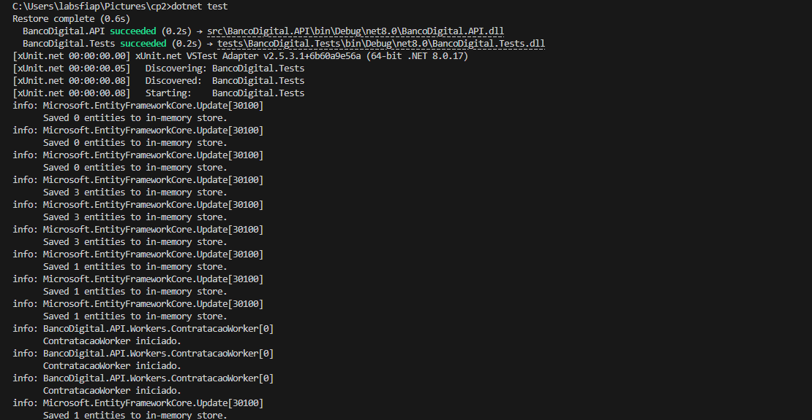

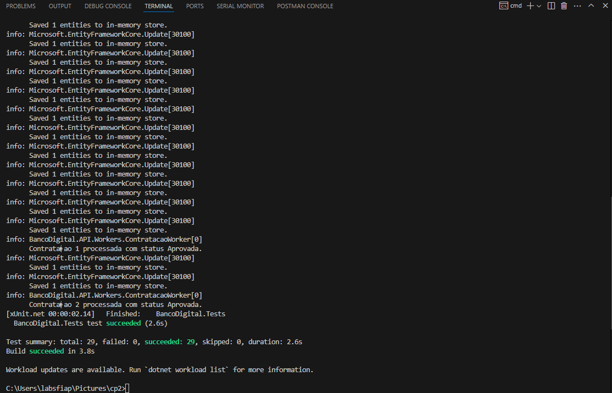

## 8. Evidências de funcionamento

### 8.1. Swagger — fluxo completo de contratação aprovada

**Passo 1 — POST `/api/clientes/pf` (cadastrar cliente):**

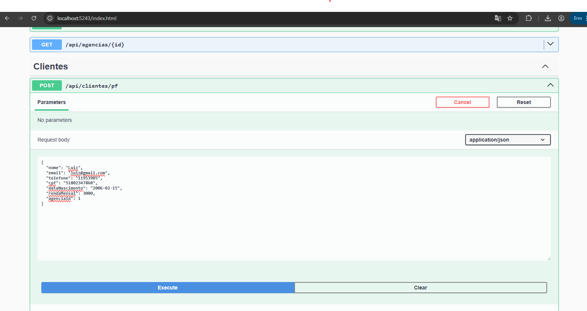
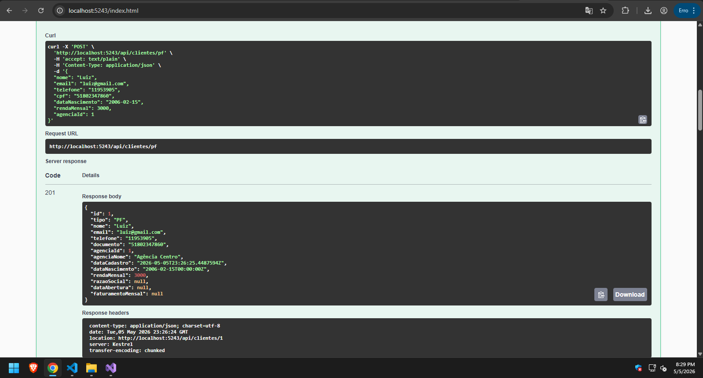

**Passo 2 — POST `/api/contratacoes` (publica na fila, retorna 202):**

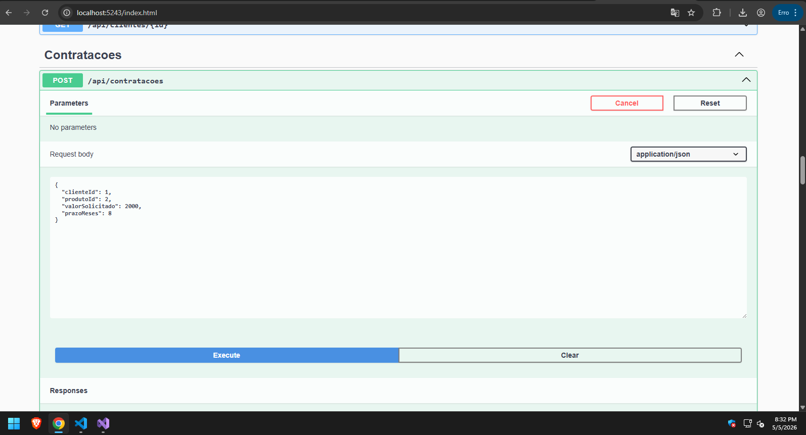
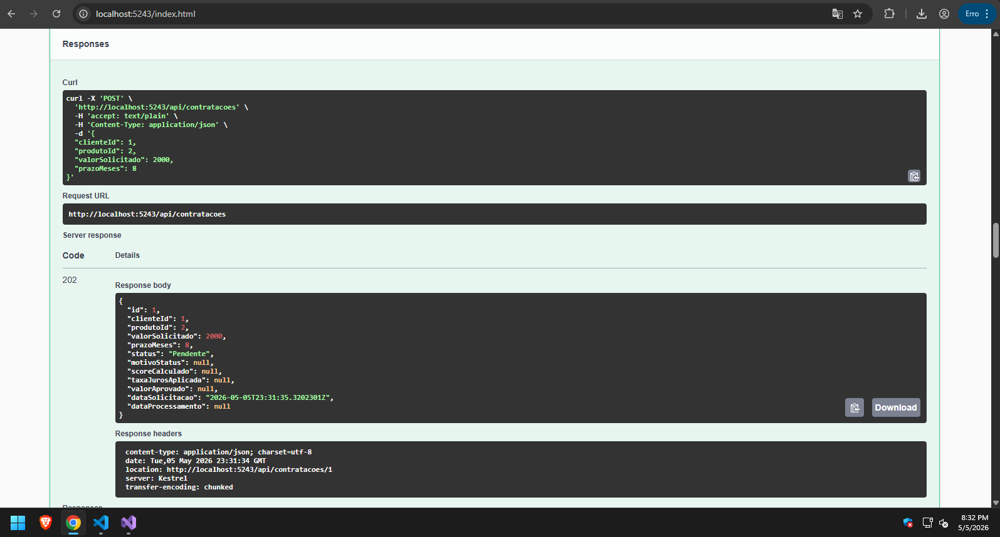

**Passo 3 — GET `/api/contratacoes/{id}` (consulta status após processamento):**

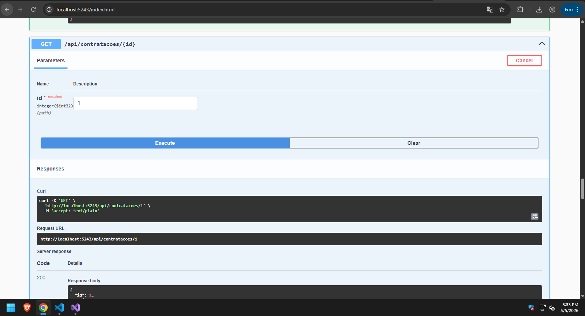
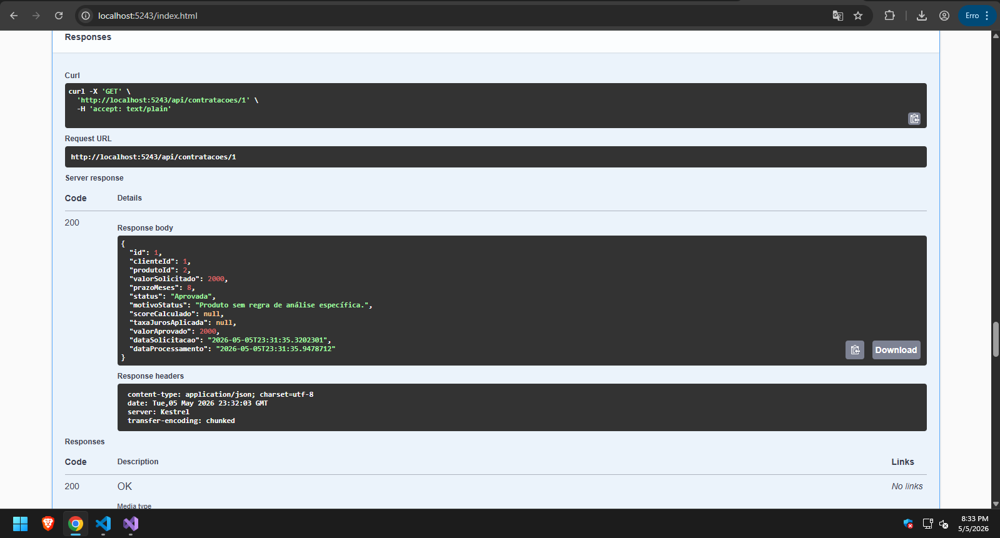

### 8.2. Oracle — tabelas criadas pela migration com registros persistidos

**Tabela `PRODUTOS` (com TPH discriminator `TIPO_PRODUTO`):**
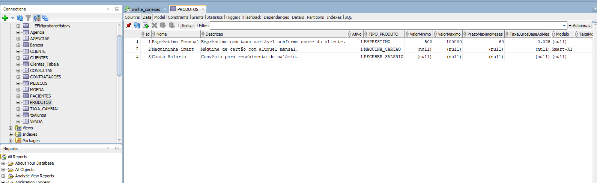

**Tabela `CLIENTES` (com TPH discriminator `TIPO_CLIENTE` para PF/PJ):**
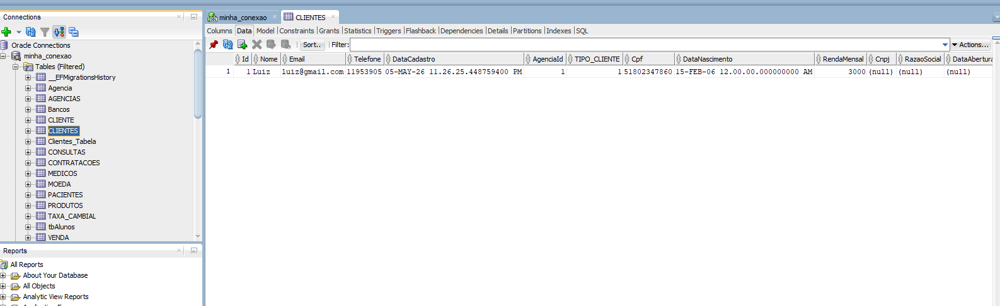

**Tabela `CONTRATACOES` (registro com status final e dados da análise de crédito):**
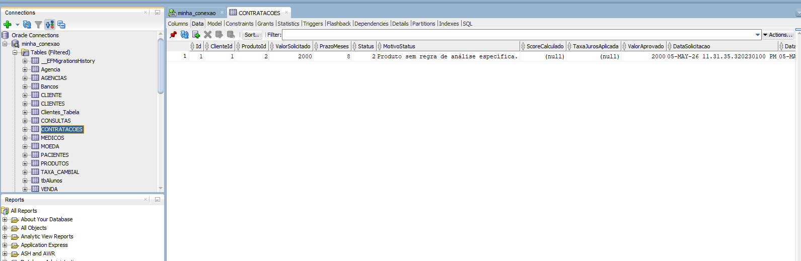

## Estrutura do projeto

```
cp2/
├── BancoDigital.sln
├── README.md
├── .gitignore
├── diagrama/
│   └── diagrama-classes.drawio    (fonte editável)
├── prints/                        (evidências: Swagger, testes, Oracle, diagrama exportado)
├── src/
│   └── BancoDigital.API/
│       ├── Controllers/           (Agencias, Clientes, Contratacoes, Produtos)
│       ├── Domain/
│       │   ├── Entities/          (Cliente, PF, PJ, Agencia, Produto, Emprestimo, ...)
│       │   └── Enums/             (TipoCliente, StatusContratacao)
│       ├── Data/
│       │   ├── AppDbContext.cs    (TPH inheritance, mapeamentos Oracle)
│       │   ├── DbSeeder.cs
│       │   └── Migrations/        (InitialCreate)
│       ├── DTOs/
│       ├── Services/              (DocumentoValidator, AnaliseCreditoService)
│       ├── Workers/               (ContratacaoQueue, ContratacaoWorker)
│       ├── Program.cs
│       └── appsettings.json
└── tests/
    └── BancoDigital.Tests/
        ├── Infra/                 (TestWebAppFactory)
        ├── Integration/           (Controllers via WebApplicationFactory + InMemory DB)
        └── Unit/                  (AnaliseCreditoService, DocumentoValidator)
```
